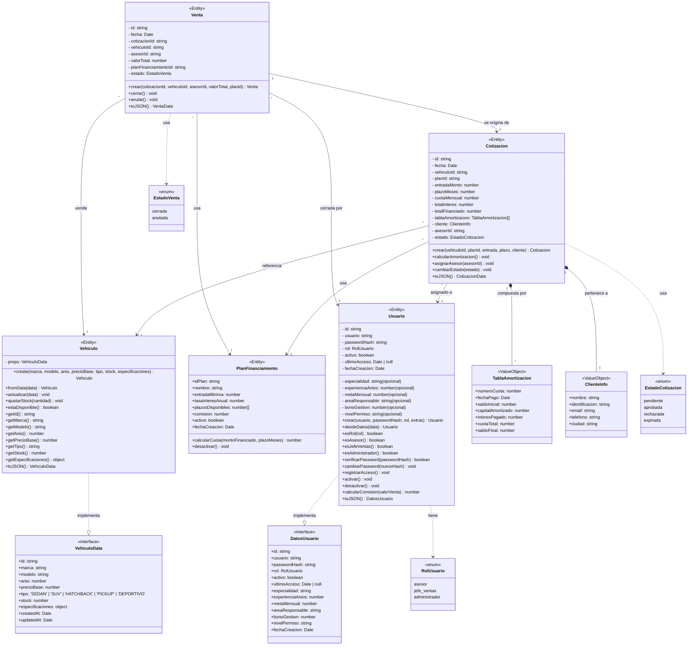

# Diagrama de Clases - AutoVentas Pro

## Entidades de Dominio

---

## Resumen de Entidades

| Entidad | Propósito | Atributos Clave |
|---------|-----------|-----------------|
| **Vehiculo** | Vehículo del catálogo | marca, modelo, año, precioBase, tipo, stock |
| **PlanFinanciamiento** | Opciones de crédito | tasaInteresAnual, plazosDisponibles, entradaMinima |
| **Usuario** | Persona con acceso (3 roles) | usuario, passwordHash, rol (asesor/jefe_ventas/admin) |
| **Cotizacion** | Simulación financiera | vehiculoId, planId, cuotaMensual, tablaAmortizacion |
| **Venta** | Cierre de venta exitosa | cotizacionId, asesorId, valorTotal, estado |

## Value Objects

| Objeto | Descripción |
|--------|-------------|
| **TablaAmortizacion** | Desglose cuota por cuota (capital + interés) |
| **ClienteInfo** | Datos del cliente potencial |

## Enumeraciones

| Enumeración | Valores |
|-------------|---------|
| **RolUsuario** | asesor, jefe_ventas, administrador |
| **EstadoCotizacion** | pendiente, aprobada, rechazada, expirada |
| **EstadoVenta** | cerrada, anulada |

---

## Cardinalidades del Diagrama

| Origen | Cardinalidad | Destino | Cardinalidad | Tipo | Significado |
|--------|:-----------:|---------|:-----------:|------|-------------|
| **Cotizacion** | `*` (muchas) | **Vehiculo** | `1` (uno) | Asociación | Un vehículo puede tener muchas cotizaciones; cada cotización referencia un solo vehículo |
| **Cotizacion** | `*` (muchas) | **PlanFinanciamiento** | `1` (uno) | Asociación | Un plan puede estar en muchas cotizaciones; cada cotización usa un solo plan |
| **Cotizacion** | `*` (muchas) | **Usuario** (asesor) | `1` (uno) | Asociación | Un asesor atiende muchas cotizaciones; cada cotización tiene un asesor asignado |
| **Cotizacion** | `1` (una) | **TablaAmortizacion** | `*` (muchas) | **Composición** | Una cotización contiene muchas filas de amortización; si se elimina la cotización, se eliminan las filas |
| **Cotizacion** | `1` (una) | **ClienteInfo** | `1` (uno) | **Composición** | Una cotización tiene un solo cliente; el cliente no existe sin la cotización |
| **Venta** | `1` (una) | **Cotizacion** | `1` (una) | Asociación | Una venta se origina de una única cotización; una cotización genera una única venta |
| **Venta** | `*` (muchas) | **Vehiculo** | `1` (uno) | Asociación | Un vehículo (modelo) puede venderse muchas veces; cada venta vende un vehículo |
| **Venta** | `*` (muchas) | **Usuario** (asesor) | `1` (uno) | Asociación | Un asesor cierra muchas ventas; cada venta es cerrada por un asesor |
| **Venta** | `*` (muchas) | **PlanFinanciamiento** | `1` (uno) | Asociación | Un plan puede estar en muchas ventas; cada venta usa un plan |

**Notación:**
- `1` → exactamente uno
- `*` → cero o muchos
- **Composición** (`*--`) → el ciclo de vida del hijo depende del padre (si el padre se elimina, el hijo también)
